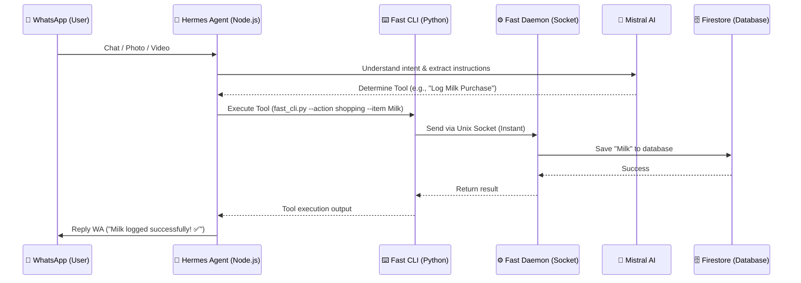

# 🏡 Home Agent (WhatsApp Personal Assistant)

*[Baca dalam Bahasa Indonesia](README.md)*

Home Agent is an AI-powered personal assistant I built to handle those trivial-yet-important household chores, right from WhatsApp.

Tired of checking an empty fridge? Too lazy to type out a recipe from a TikTok video? Or maybe you just want to track your daily expenses by snapping a photo of your grocery receipt? Well, this bot does all of that for you.

## ✨ Key Features

- 🛒 **Smart Shopping List:** It doesn't just take notes. Send a link from Shopee or Tokopedia, and the bot will automatically extract the product name for you.
- 🧾 **Snap a Receipt (Vision AI):** Too lazy to log expenses one by one? Just snap a photo of your grocery receipt. The AI will read the prices, calculate the total, and categorize the expense automatically.
- ❄️ **Fridge & Pantry Management:** Keep track of your food stock in real-time.
- 🍳 **Smart Recipe Book & Video Extractor:** Got a recipe video from TikTok or YouTube? Just send the link. The Multimodal AI will watch it and save the ingredients and cooking steps straight into your recipe database.
- 💰 **Comprehensive Finance Management:** Track daily/weekly expenses, log recurring monthly bills (Bills), and track your savings/liquid investments (Assets). Every time you log an expense, the bot tells you your remaining budget.
- ⏰ **Smart Reminders:** Set one-time or recurring reminders right from WhatsApp. Plus, the bot automatically sends weekly finance reports.
- 🤖 **Mistral AI Engine:** Powered by Mistral (super fast & efficient) for main logic and smart data extraction.

## 📱 TikTok Bulk Importer (Tutorial)

If you have hundreds of favorite recipe videos on TikTok and want to automatically import them to your Home Agent database, you can use the *Bulk Importer* scripts:

1. **Request TikTok Data:** Open the TikTok app > *Settings and privacy* > *Account* > *Download your data*. Make sure to select **JSON** format!
2. **Scan Recipes:** Place the `user_data_tiktok.json` file into this project folder (or `tiktok_data` folder) and run:
   ```bash
   python scripts/scan_tiktok_recipes.py
   ```
   This script will filter out videos that are highly likely to be cooking recipes based on their titles (takes ~1 minute).
3. **Extract & Import:** Once done, run:
   ```bash
   python scripts/import_tiktok_recipes.py
   ```
   The AI will sequentially "watch" and read all those videos, saving them into your Recipe Book automatically. This script comes with an *Auto-Resume* feature, so it's safe if you get disconnected!
## 📊 How Does It Work? (Architecture)

To prevent slow replies and *cold starts*, I built the architecture using a *socket daemon*. This keeps Firebase and the AI models on standby in the server's memory. When a chat comes in, execution is lightning-fast!



## 🛠️ Tech Stack

- **AI Engine:** Mistral API handled by the **Hermes Agent** framework.
- **WhatsApp Bridge:** Node.js (via Baileys).
- **Database:** Firebase Firestore (GCP).
- **Hosting:** Oracle Cloud VPS (Ubuntu).
- **CI/CD:** GitHub Actions.

## 🚀 CI/CD Pipeline (Auto-Deploy)

Whenever code changes are pushed to the `main` branch, GitHub Actions automatically triggers a runner to SSH into the VPS, pull the latest code, and restart the bot service. No more tedious manual SSH just to update a feature.

## 🔒 Security & Credentials Setup

Don't worry, sensitive data like `.env`, Firebase `.json` credentials, and SSH `.key` files are securely blocked by `.gitignore`.

If you want to run or fork this bot locally:
1. Copy `.env.example` to `.env` and insert your Mistral API Key.
2. Place your Firebase service account file (`firebase-credentials.json`) in the root folder.
3. Set up and run the Python daemon!
