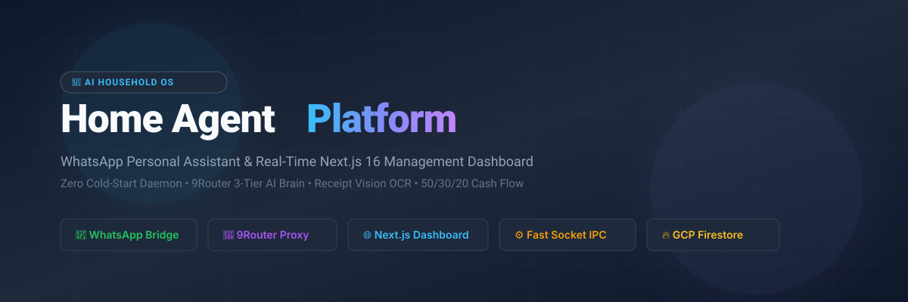
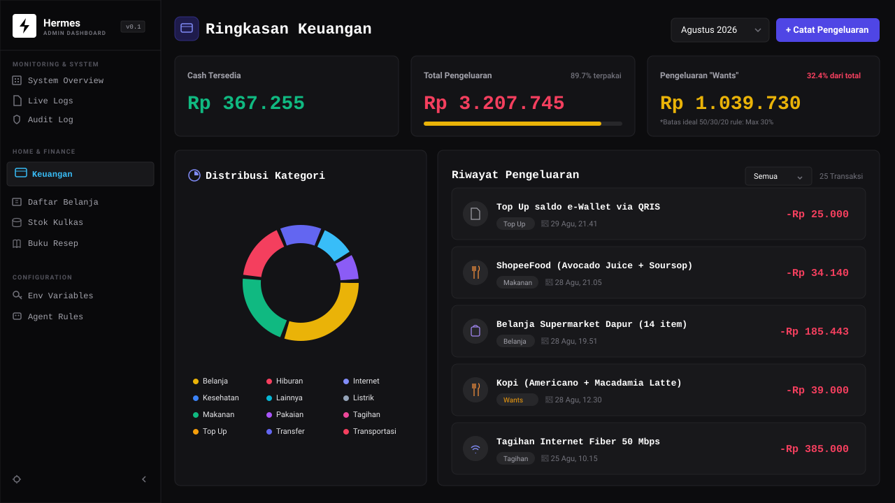
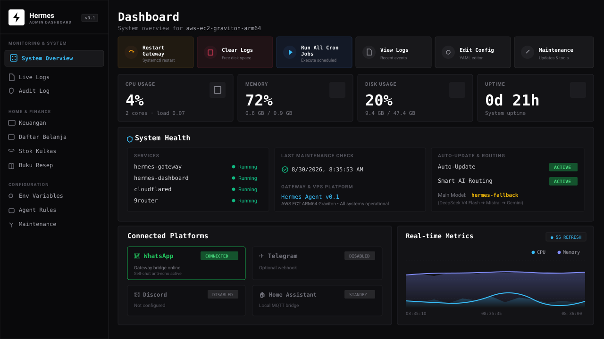
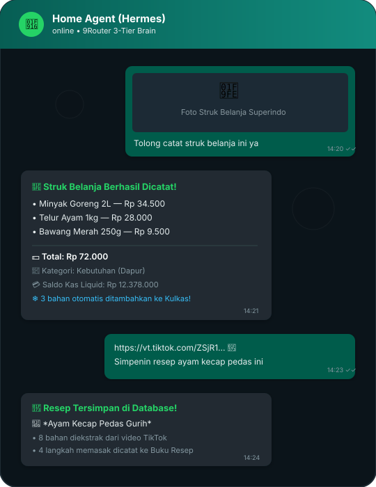
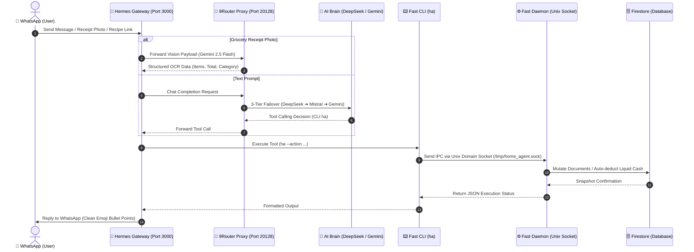
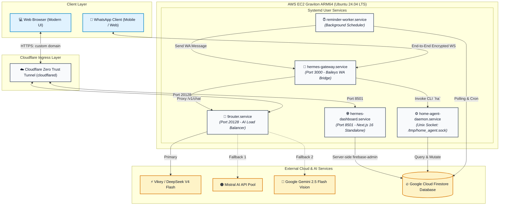
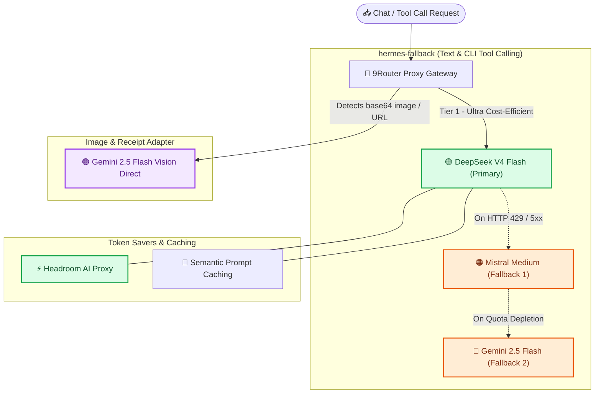
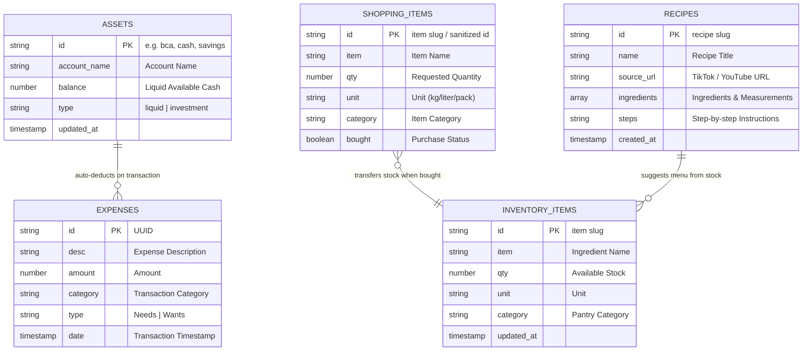

# 🏡 Home Agent — Intelligent Household OS & Personal Assistant

<p align="center">
  
</p>

<p align="center">
  <a href="https://github.com/cantikapf/home-agent-template/blob/main/LICENSE"></a>
  
  
  
  
  
</p>

<p align="center">
  <b>An autonomous AI-powered household operating system operating via WhatsApp and a real-time Next.js 16 web dashboard.</b><br />
  Instant receipt OCR (Vision AI), real cash flow tracking with Zero-Budgeting (50/30/20 Wants Rule), pantry inventory management, and automated TikTok/YouTube recipe ingestion.
</p>

<p align="center">
  <a href="README.md">Baca dalam Bahasa Indonesia</a> • <a href="README-en.md"><b>English</b></a>
</p>

---

## 📸 Interface & System Preview

| **Finance & Cash Flow (`/finance`)** | **System Overview & Health (`/`)** |
|:---:|:---:|
|  |  |

<p align="center">
  <b>WhatsApp Assistant Interaction (Vision OCR Receipt &amp; Cooking Recipes):</b><br />
  
</p>

---

## ✨ Core Features

- 🧾 **Snap a Receipt (Vision AI):** Too lazy to manually log every expense? Just send a photo of your receipt on WhatsApp. Google Gemini 2.5 Flash reads line items, calculates totals, and categorizes transactions instantly.
- 💰 **Zero-Budgeting & 50/30/20 Wants Rule:** Eliminates rigid, unrealistic monthly budgets. Financial health centers on **Liquid Available Cash**. Impulsive lifestyle spending (*Wants*) is strictly monitored under a 30% monthly ratio with proactive spending alerts.
- ❄️ **Smart Fridge & Pantry Management:** Track perishable food items with dynamic units (pieces, kg, liters), low-stock alerts, and auto-deduction when preparing recipes.
- 🛒 **Integrated Shopping List:** Queue shopping items. When items are purchased (`ha --action bought`), the system automatically logs the expense, auto-deducts liquid cash, and moves items to fridge inventory. Supports Tokopedia and Shopee OpenGraph link extraction.
- 🍳 **Multimodal Video Recipe Extractor:** Send a TikTok or YouTube cooking video link. The multimodal AI watches the video, extracting ingredients and step-by-step cooking steps directly into your recipe collection.
- ⏰ **Smart Reminders & Weekly Briefings:** Set one-time or recurring reminders (*daily/weekly/monthly*). Every Sunday evening, the assistant sends an automated cash flow summary directly to WhatsApp.
- ⚡ **Zero Cold-Start Python Daemon:** In-memory Unix domain socket architecture keeps Firestore connections and Python modules warm in server memory for sub-second execution times.
- 🔀 **Multi-Tier AI Brain (9Router Gateway):** 3-tier intelligent fallback routing (**DeepSeek V4 Flash** primary ➔ **Mistral Medium** fallback 1 ➔ **Gemini 2.5 Flash** fallback 2) ensures 99.9% uptime at near-zero inference cost.

---

## 📊 Architecture & Workflow Visualizations

### 1. Request Lifecycle
End-to-end user request flow from WhatsApp to Firestore mutations and back:



---

### 2. Server Infrastructure & Port Topology
Background processes on AWS EC2 Graviton connected via Cloudflare Zero Trust:



---

### 3. AI Fallback & Token Saver Architecture (9Router)
Multi-provider defense chain to eliminate downtime and rate limits:



---

### 4. Data Entity Schema (Firestore Collections)
NoSQL collection architecture linking expenses, pantry, cash, and recipes:



---

## 🛠️ Tech Stack

- **AI Inference:** 9Router Proxy, DeepSeek V4 Flash, Mistral Medium, Google Gemini 2.5 Flash (Vision OCR).
- **Backend & Core Engine:** Python 3.11+, Unix Domain Sockets, `firebase-admin`, Google GenAI SDK.
- **Frontend Dashboard:** Next.js 16 (App Router, Standalone mode), React 19, TypeScript, Tailwind CSS v4, Lucide Icons, Recharts.
- **WhatsApp Bridge:** Node.js 20+ (Baileys library via Hermes Agent).
- **Database:** Google Cloud Firestore (GCP NoSQL).
- **Hosting & Infrastructure:** AWS EC2 (`t4g.micro` ARM64 Graviton, Ubuntu 24.04 LTS), Cloudflare Zero Trust Tunnel.

---

## 🚀 Setup & Installation Guide

### 1. System Prerequisites
- **Python:** Version 3.11 or later.
- **Node.js:** Version 20.x or later (`npm` or `pnpm`).
- **Google Cloud Project:** Firestore activated with a downloaded Service Account JSON.
- **API Keys:** Google Gemini AI Studio key (for Vision OCR) and/or 9Router / DeepSeek / Mistral credentials.

### 2. Clone Repository & Configure Environment
```bash
git clone https://github.com/cantikapf/home-agent-template.git
cd home-agent-template

# Create backend environment file
cp .env.example .env

# Place your GCP service account JSON in the root directory
cp /path/to/your-service-account.json firebase-credentials.json
```

### 3. Run Python Backend (Socket Daemon)
```bash
# Setup virtual environment & dependencies
python3 -m venv venv
source venv/bin/activate  # On Windows: venv\Scripts\activate
pip install -r requirements.txt

# Launch socket daemon in the background
python fast_daemon.py
```

### 4. Run Next.js Web Dashboard
```bash
cd web
cp .env.example .env.local
npm install
npm run dev
```
Open your browser at `http://localhost:8501` to view your real-time financial cash flow, fridge inventory, and shopping list.

---

## ⚙️ Environment Variables Reference

| Variable | Required? | Description | Example |
|---|:---:|---|---|
| `GEMINI_API_KEY` | **Yes** | Google AI Studio Key for Vision OCR | `AIzaSyD...` |
| `NINEROUTER_URL` | Optional | Local or remote 9Router proxy URL | `http://localhost:20128/v1` |
| `FIREBASE_CREDENTIALS_PATH` | **Yes** | Path to service account JSON key | `./firebase-credentials.json` |
| `HERMES_PYTHON` | Optional | Python binary path for reminder scheduler | `/home/ubuntu/home-agent/venv/bin/python` |
| `PORT` | Optional | Port for Next.js Web Dashboard | `8501` |

---

## 📱 TikTok Bulk Importer (Tutorial)

If you have dozens or hundreds of recipe bookmarks on TikTok and want to automatically import them:

1. **Request TikTok Data:** Go to TikTok > *Settings and Privacy* > *Account* > *Download your data*. Select **JSON** format.
2. **Scan Recipes:** Place `user_data_tiktok.json` in the `tiktok_data/` folder and run:
   ```bash
   python scripts/scan_tiktok_recipes.py
   ```
   This script rapidly scans and filters cooking recipes based on title keywords.
3. **Automated AI Extraction:** Run:
   ```bash
   python scripts/import_tiktok_recipes.py
   ```
   The Multimodal AI sequentially reads the videos, saving ingredients and cooking steps directly to Firestore with built-in *Auto-Resume*.

---

## 🔒 Security & Privacy Notice

- Sensitive credentials (`*.pem`, `*.key`, `*-credentials.json`, API key files, `.env`) are strictly excluded by `.gitignore`.
- The Next.js dashboard uses server-side data fetching via `firebase-admin`, preventing Firebase service account exposure to client browsers.

---

## 📄 License

Distributed under the **MIT License**. See [LICENSE](LICENSE) for more details.

> **Disclaimer:** This project is designed for personal household automation. Financial calculations and the 50/30/20 ratio are provided for informational tracking and do not constitute professional financial advice.

