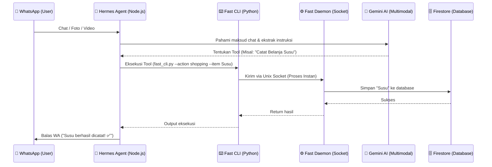

# 🏡 Home Agent (WhatsApp Personal Assistant)

*[Read in English](README-en.md)*

Home Agent adalah bot asisten pribadi berbasis AI yang saya bikin untuk ngurusin hal-hal remeh tapi penting di rumah tangga, langsung dari chat WhatsApp.

Capek ngecek kulkas kosong? Males ngetik ulang resep dari video TikTok? Atau pengen nyatet pengeluaran harian cuma modal foto struk belanja? Nah, bot ini yang bakal ngerjain itu semua.

## ✨ Fitur Utama

- 🛒 **Daftar Belanja Pintar:** Gak cuma nyatet belanjaan biasa, kalau kamu kirim link dari Shopee atau Tokopedia, bot bisa langsung nge-ekstrak nama barangnya otomatis.
- 🧾 **Tinggal Foto Struk (Vision AI):** Malas nyatet pengeluaran satu-satu? Foto aja struk belanjanya. AI bakal baca harganya, nge-total, dan masukin ke kategori pengeluaran yang pas.
- ❄️ **Manajemen Kulkas & Dapur:** Cek sisa stok bahan makanan. Kalau udah mau habis, bot bakal ngingetin dan otomatis masukin barang itu ke daftar belanjaan.
- 🍳 **Buku Resep & TikTok Extractor:** Punya video resep dari TikTok/YouTube? Kirim aja link-nya (atau videonya). Multimodal AI bakal nonton videonya dan nyatet bahan serta cara masaknya ke database resep kamu.
- 💰 **Budgeting Bulanan:** Pantau terus dompet bulanan kamu. Setiap nyatet pengeluaran, bot ngasih tahu sisa saldo budget bulan ini.
- ⏰ **Reminder & Weekly Report:** Bisa di-set buat ngingetin sesuatu. Plus, tiap hari Minggu jam 7 malam, bot bakal ngirim laporan mingguan (pengeluaran minggu ini, sisa budget, stok kulkas yang menipis).
- 📝 **TL;DR:** Minta bot buat ngerangkum chat atau artikel panjang biar hemat waktu.

## 📊 Gimana Cara Kerjanya? (Arsitektur)

Biar gak lemot dan *cold start*, saya bikin arsitekturnya pakai *daemon socket*. Jadi, Firebase dan AI model-nya tetap *standby* di memori server. Kalau ada chat masuk, eksekusinya kilat!

## 🛠️ Tech Stack

- **AI Engine:** Google Gemini (Gemini 2.5 Flash & Flash-Lite) di-handle oleh framework **Hermes Agent**.
- **WhatsApp Bridge:** Node.js (via Baileys).
- **Database:** Firebase Firestore (GCP).
- **Hosting:** Oracle Cloud VPS (Ubuntu).
- **CI/CD:** GitHub Actions.

## 🚀 CI/CD Pipeline (Auto-Deploy)

Setiap ada perubahan kode yang di-push ke branch `main`, GitHub Actions bakal otomatis nge-trigger *runner* masuk ke VPS (via SSH), narik kode terbaru, dan nge-restart service bot di server. Jadi gak perlu repot *remote* server tiap kali ada *update* fitur.

## 🔒 Security & Setup Kredensial

Tenang, data rahasia kayak `.env`, file kredensial `.json` dari Firebase, dan *private key* SSH (`.key`) udah aman di-block sama `.gitignore`.

Kalau kamu mau jalanin atau me- *fork* bot ini di komputer sendiri:
1. Copy `.env.example` jadi `.env` lalu masukin API Key Gemini kamu.
2. Letakkan file *service account* Firebase kamu (`firebase-credentials.json`) di folder *root*.
3. Setup dan jalankan *daemon* Python-nya!
