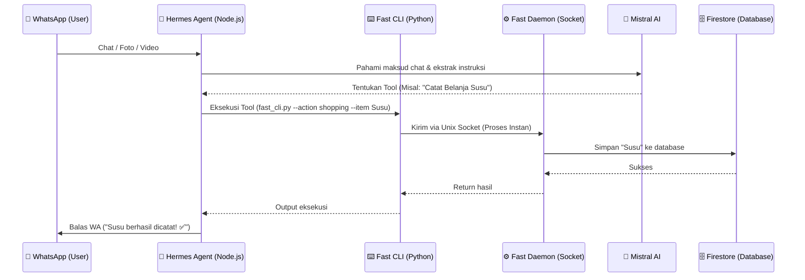

# 🏡 Home Agent (WhatsApp Personal Assistant)

*[Read in English](README-en.md)*

Home Agent adalah bot asisten pribadi berbasis AI yang saya bikin untuk ngurusin hal-hal remeh tapi penting di rumah tangga, langsung dari chat WhatsApp.

Capek ngecek kulkas kosong? Males ngetik ulang resep dari video TikTok? Atau pengen nyatet pengeluaran harian cuma modal foto struk belanja? Nah, bot ini yang bakal ngerjain itu semua.

## ✨ Fitur Utama

- 🛒 **Daftar Belanja Pintar:** Gak cuma nyatet belanjaan biasa, kalau kamu kirim link dari Shopee atau Tokopedia, bot bisa langsung nge-ekstrak nama barangnya otomatis.
- 🧾 **Tinggal Foto Struk (Vision AI):** Malas nyatet pengeluaran satu-satu? Foto aja struk belanjanya. AI bakal baca harganya, nge-total, dan masukin ke kategori pengeluaran yang pas.
- ❄️ **Manajemen Kulkas & Dapur:** Cek sisa stok bahan makanan.
- 🍳 **Buku Resep & Video Extractor:** Punya video resep dari TikTok atau YouTube? Kirim aja link-nya. Multimodal AI bakal nonton videonya dan nyatet bahan serta cara masaknya ke database resep kamu.
- 💰 **Manajemen Keuangan Terpadu:** Pantau pengeluaran harian/mingguan, catat tagihan bulanan (Bills), hingga pencatatan aset investasi/tabungan liquid (Assets). Tiap nyatat pengeluaran, bot ngasih tahu sisa budget bulanan.
- ⏰ **Reminder & Weekly Report:** Pasang alarm satu kali atau berulang (harian/mingguan). Plus, tiap minggu bot otomatis kirim laporan keuangan.
- 🤖 **Mistral AI Engine:** Ditenagai oleh Mistral (super cepat & irit) untuk logika utama dan ekstraksi data cerdas.

## 📱 TikTok Bulk Importer (Tutorial)

Buat kamu yang punya ratusan video resep favorit di TikTok dan pengen memindahkannya ke database Home Agent secara otomatis, kamu bisa pakai script *Bulk Importer*:

1. **Request Data TikTok:** Buka aplikasi TikTok > *Settings and privacy* > *Account* > *Download your data*. Pilih format **JSON**!
2. **Scan Resep:** Taruh file `user_data_tiktok.json` di dalam folder proyek ini (`tiktok_data` jika perlu), lalu jalankan:
   ```bash
   python scripts/scan_tiktok_recipes.py
   ```
   Skrip ini akan menyeleksi mana video yang kemungkinan besar adalah resep masakan berdasarkan judulnya (memakan waktu ~1 menit).
3. **Ekstrak & Impor:** Setelah beres, jalankan:
   ```bash
   python scripts/import_tiktok_recipes.py
   ```
   AI bakal "menonton" dan membaca satu per satu ratusan video tersebut, lalu menyimpannya ke Buku Resep kamu secara otomatis. Skrip ini punya fitur *Auto-Resume* jadi aman kalau terputus!
## 📊 Gimana Cara Kerjanya? (Arsitektur)

Biar gak lemot dan *cold start*, saya bikin arsitekturnya pakai *daemon socket*. Jadi, Firebase dan AI model-nya tetap *standby* di memori server. Kalau ada chat masuk, eksekusinya kilat!



## 🛠️ Tech Stack

- **AI Engine:** Mistral API di-handle oleh framework **Hermes Agent**.
- **WhatsApp Bridge:** Node.js (via Baileys).
- **Database:** Firebase Firestore (GCP).
- **Hosting:** Oracle Cloud VPS (Ubuntu).
- **CI/CD:** GitHub Actions.

## 🚀 CI/CD Pipeline (Auto-Deploy)

Setiap ada perubahan kode yang di-push ke branch `main`, GitHub Actions bakal otomatis nge-trigger *runner* masuk ke VPS (via SSH), narik kode terbaru, dan nge-restart service bot di server. Jadi gak perlu repot *remote* server tiap kali ada *update* fitur.

## 🔒 Security & Setup Kredensial

Tenang, data rahasia kayak `.env`, file kredensial `.json` dari Firebase, dan *private key* SSH (`.key`) udah aman di-block sama `.gitignore`.

Kalau kamu mau jalanin atau me- *fork* bot ini di komputer sendiri:
1. Copy `.env.example` jadi `.env` lalu masukin API Key Mistral kamu.
2. Letakkan file *service account* Firebase kamu (`firebase-credentials.json`) di folder *root*.
3. Setup dan jalankan *daemon* Python-nya!
