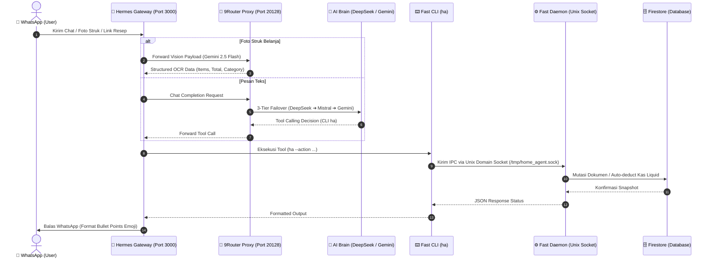
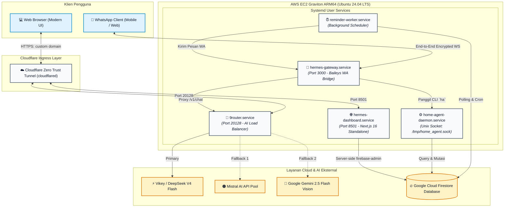
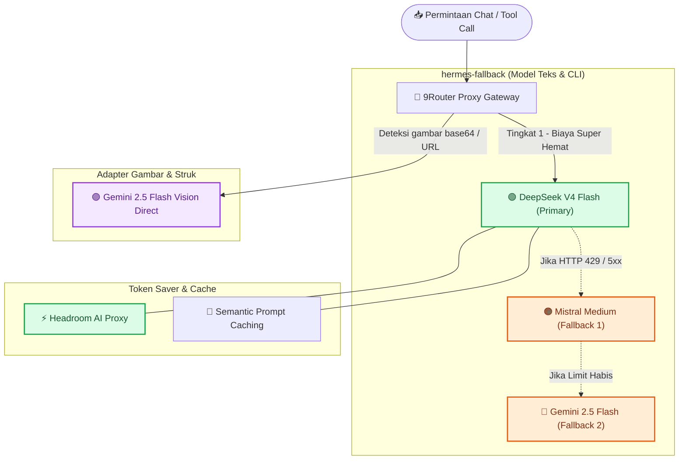
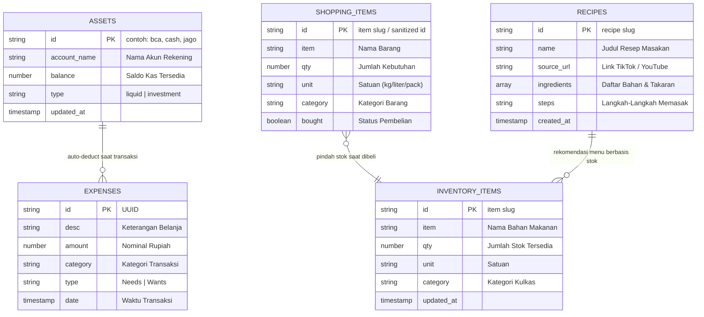

# 🏡 Home Agent — Intelligent Household OS & Personal Assistant

<p align="center">
  
</p>

<p align="center">
  <a href="https://github.com/cantikapf/home-agent-template/blob/main/LICENSE"></a>
  
  
  
  
  
</p>

<p align="center">
  <b>Asisten rumah tangga otonom berbasis Multimodal AI via WhatsApp dan Web Dashboard Next.js real-time.</b><br />
  Pencatatan struk belanja instan (Vision AI), arus kas riil tanpa budget statis (Aturan Wants 50/30/20), manajemen stok kulkas, dan ekstraksi resep TikTok/YouTube otomatis.
</p>

<p align="center">
  <a href="README.md"><b>Bahasa Indonesia</b></a> • <a href="README-en.md">Read in English</a>
</p>

---

## 📸 Antarmuka & Preview Sistem

| **Ringkasan Keuangan & Arus Kas (`/finance`)** | **System Overview & Health (`/`)** |
|:---:|:---:|
|  |  |

<p align="center">
  <b>Interaksi Asisten WhatsApp (Vision OCR Struk &amp; Resep Masakan):</b><br />
  
</p>

---

## ✨ Fitur Utama

- 🧾 **Tinggal Foto Struk (Vision AI):** Malas mengetik pengeluaran satu per satu? Cukup kirim foto struk belanjaan di WhatsApp. Google Gemini 2.5 Flash membaca item belanja, nominal, menjumlahkan total, dan mengklasifikasikan kategori secara instan.
- 💰 **Zero-Budgeting & Pemantauan Wants 50/30/20:** Sistem tidak menggunakan batas budget bulanan statis yang tidak realistis. Keuangan berpusat pada **Saldo Kas Liquid** riil. Pengeluaran gaya hidup (*Wants*) dipantau ketat di bawah rasio 30% pengeluaran bulanan. Jika boros, asisten akan menegur secara tegas.
- ❄️ **Manajemen Kulkas & Stok Dapur:** Pantau bahan makanan di kulkas dengan satuan dinamis (butir, kg, liter), status stok rendah, dan pengurangan otomatis saat memasak.
- 🛒 **Daftar Belanja Terpadu:** Catat rencana belanjaan. Saat barang dibeli (`ha --action bought`), sistem otomatis mencatat pengeluaran, mengurangi saldo kas liquid, dan memindahkan barang ke stok kulkas. Mendukung ekstraksi link produk Shopee/Tokopedia.
- 🍳 **Ekstraktor Resep Video (TikTok & YouTube):** Kirim link video masakan, AI multimodal akan menonton video tersebut dan mengekstrak bahan serta panduan langkah memasak ke database resep.
- ⏰ **Pengingat Cerdas & Laporan Mingguan:** Pasang alarm satu kali atau berulang (*daily/weekly/monthly*). Setiap Minggu malam, bot mengirimkan ringkasan arus kas mingguan langsung ke WhatsApp.
- ⚡ **Zero Cold-Start Python Daemon:** Arsitektur *in-memory Unix domain socket* menjaga koneksi Firebase dan modul Python tetap hangat di RAM server untuk latensi eksekusi sub-detik.
- 🔀 **Multi-Tier AI Brain (9Router Gateway):** Routing cerdas 3 lapis (**DeepSeek V4 Flash** primary ➔ **Mistral Medium** fallback 1 ➔ **Gemini 2.5 Flash** fallback 2) untuk jaminan uptime 99.9% dengan biaya operasional sangat hemat.

---

## 📊 Visualisasi Alur Kerja & Arsitektur

### 1. Siklus Hidup Permintaan (Request Lifecycle)
Alur interaksi dari pesan WhatsApp pengguna hingga mutasi data di Firestore dan respon kembali ke pengguna:



---

### 2. Topologi Infrastruktur Server & Port
Arsitektur proses background di server AWS EC2 Graviton dan tunneling Cloudflare Zero Trust:



---

### 3. Arsitektur AI Fallback & Token Saver (9Router)
Sistem proteksi multi-provider untuk mencegah downtime atau rate limit:



---

### 4. Skema Relasi Data (Firestore Collections)
Model data NoSQL yang menghubungkan mutasi belanja, kulkas, kas, dan resep:



---

## 🛠️ Tech Stack

- **AI Inference:** 9Router Proxy, DeepSeek V4 Flash, Mistral Medium, Google Gemini 2.5 Flash (Vision OCR).
- **Backend & Core Engine:** Python 3.11+, Unix Domain Sockets, `firebase-admin`, Google GenAI SDK.
- **Frontend Dashboard:** Next.js 16 (App Router, Standalone mode), React 19, TypeScript, Tailwind CSS v4, Lucide Icons, Recharts.
- **WhatsApp Bridge:** Node.js 20+ (Baileys library via Hermes Agent).
- **Database:** Google Cloud Firestore (GCP NoSQL).
- **Hosting & Infrastructure:** AWS EC2 (`t4g.micro` ARM64 Graviton, Ubuntu 24.04 LTS), Cloudflare Zero Trust Tunnel.

---

## 🚀 Panduan Setup & Instalasi

### 1. Prasyarat Sistem
- **Python:** Versi 3.11 atau lebih baru.
- **Node.js:** Versi 20.x atau lebih baru (`npm` atau `pnpm`).
- **Google Cloud Project:** Firestore aktif dan unduh service account JSON.
- **API Keys:** Google Gemini AI Studio key (untuk Vision OCR) dan/atau akun 9Router / DeepSeek / Mistral.

### 2. Kloning Repositori & Environment
```bash
git clone https://github.com/cantikapf/home-agent-template.git
cd home-agent-template

# Buat berkas environment backend
cp .env.example .env

# Letakkan service account GCP di folder root
cp /path/to/your-service-account.json firebase-credentials.json
```

### 3. Menjalankan Backend Python (Socket Daemon)
```bash
# Setup virtual environment & dependencies
python3 -m venv venv
source venv/bin/activate  # Di Windows: venv\Scripts\activate
pip install -r requirements.txt

# Jalankan daemon socket di background
python fast_daemon.py
```

### 4. Menjalankan Web Dashboard Next.js
```bash
cd web
cp .env.example .env.local
npm install
npm run dev
```
Buka browser di `http://localhost:8501` untuk melihat dashboard keuangan, kulkas, dan daftar belanja.

---

## ⚙️ Referensi Environment Variables

| Variabel | Wajib? | Deskripsi | Contoh Nilai |
|---|:---:|---|---|
| `GEMINI_API_KEY` | **Ya** | API Key Google AI Studio untuk Vision OCR | `AIzaSyD...` |
| `NINEROUTER_URL` | Opsional | URL Proxy 9Router lokal atau remote | `http://localhost:20128/v1` |
| `FIREBASE_CREDENTIALS_PATH` | **Ya** | Path ke file service account JSON | `./firebase-credentials.json` |
| `HERMES_PYTHON` | Opsional | Path biner python untuk reminder worker | `/home/ubuntu/home-agent/venv/bin/python` |
| `PORT` | Opsional | Port untuk Web Dashboard Next.js | `8501` |

---

## 📱 TikTok Bulk Importer (Tutorial)

Bagi Anda yang memiliki puluhan atau ratusan video resep favorit di TikTok dan ingin menyalinnya otomatis ke database resep:

1. **Unduh Data TikTok:** Buka TikTok > *Pengaturan & Privasi* > *Akun* > *Unduh data Anda*. Pilih format **JSON**.
2. **Scan Resep:** Taruh file `user_data_tiktok.json` di folder `tiktok_data/`, lalu jalankan:
   ```bash
   python scripts/scan_tiktok_recipes.py
   ```
   Skrip ini memfilter video kuliner/resep berdasarkan kata kunci judul dalam waktu singkat.
3. **Ekstraksi AI Otomatis:** Jalankan:
   ```bash
   python scripts/import_tiktok_recipes.py
   ```
   Multimodal AI akan memproses video satu per satu dan menyimpan bahan serta instruksi ke Firestore secara otomatis dengan fitur *Auto-Resume*.

---

## 🔒 Keamanan & Sanitasi Kredensial

- Seluruh kredensial sensitif (`*.pem`, `*.key`, `*-credentials.json`, file API key, `.env`) diblokir ketat oleh `.gitignore`.
- Dashboard Next.js beroperasi secara *server-side* menggunakan `firebase-admin`, sehingga kredensial Firebase tidak pernah terekspos ke browser pengguna.

---

## 📄 Lisensi

Didistribusikan di bawah **MIT License**. Lihat berkas [LICENSE](LICENSE) untuk detail lengkap.

> **Catatan:** Proyek ini dibuat untuk otomatisasi urusan rumah tangga pribadi. Perhitungan keuangan dan rasio 50/30/20 disediakan untuk panduan praktis dan bukan nasihat keuangan profesional.

